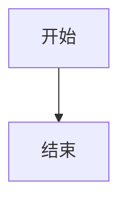

# {TITLE} - v{VERSION}

**日期**: {DATE}
**版本**: v{VERSION}
**类型**: {TYPE} (技术方案/Bug修复/代码设计)

## 问题描述
描述需要解决的技术问题或要实现的功能。

## 解决方案

### 方案概述
简要描述采用的解决方案。

### 实现细节

#### 关键代码
```语言
// 代码示例
```

#### 技术要点
1. 要点 1
2. 要点 2

### 架构/流程图


## 相关文件
- 文件路径 1: 说明
- 文件路径 2: 说明

## 测试验证
- 测试方法: 描述
- 预期结果: 描述
- 实际结果: 描述

## 参考资料
- [链接 1](URL)
- [相关文档](../其他文档.md)
